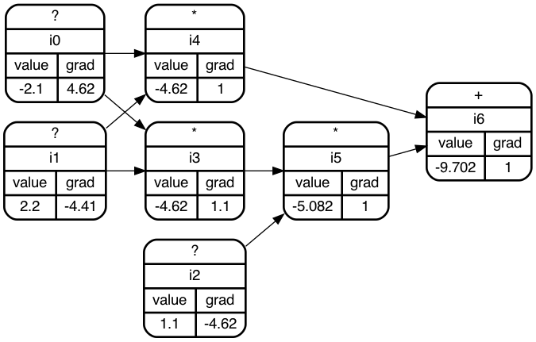

# autograd
A tiny from scratch autograd implementation for learning purposes. Inspired by [micrograd](https://github.com/karpathy/micrograd) and [tinygrad](https://github.com/geohot/tinygrad).

----

